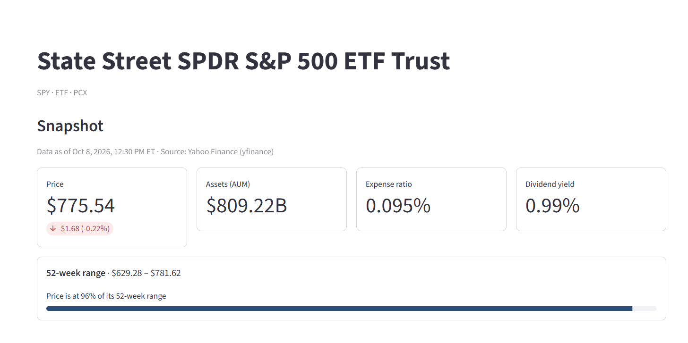
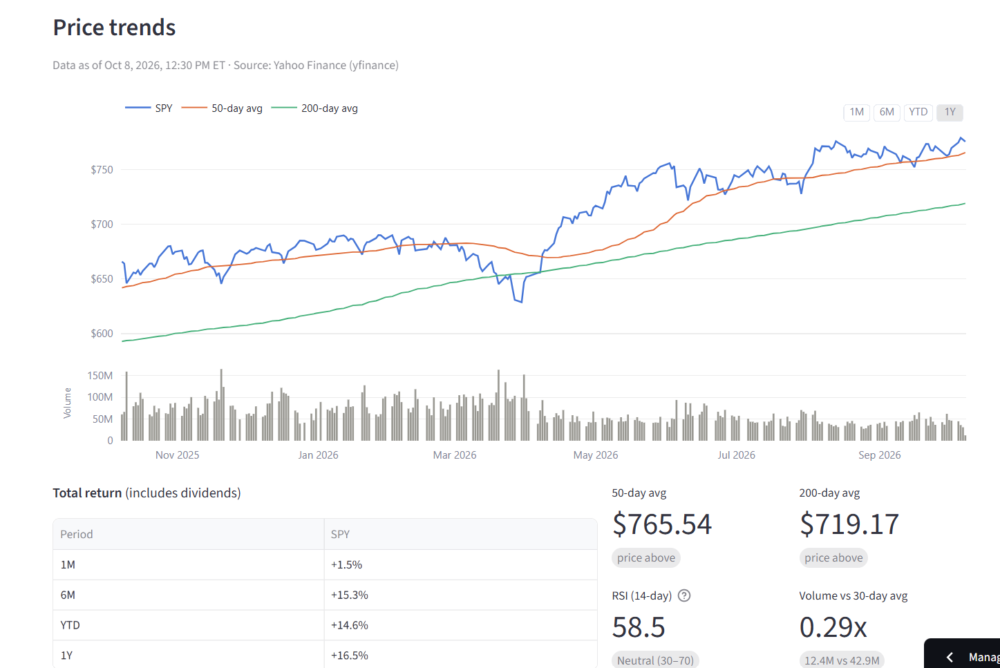
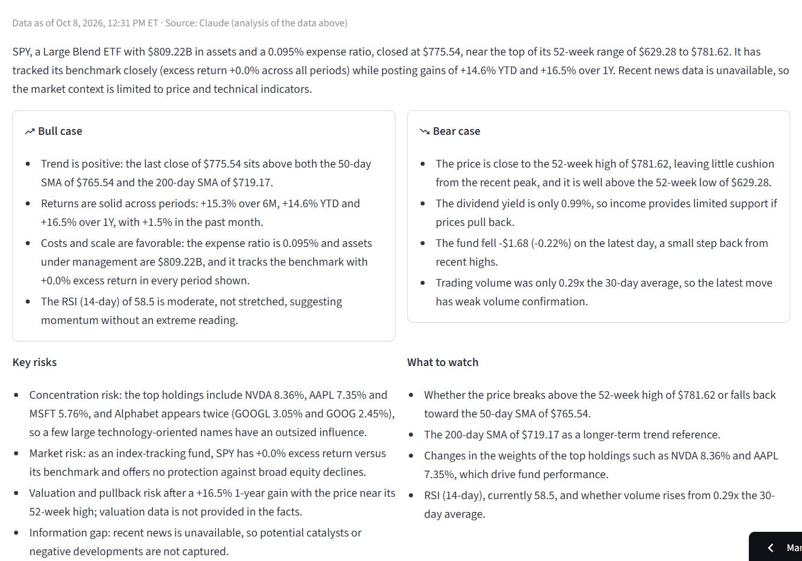
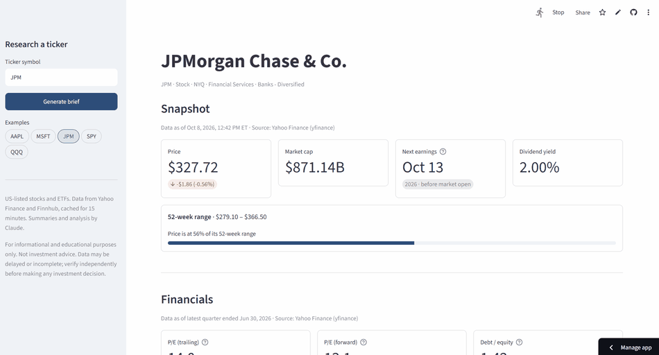
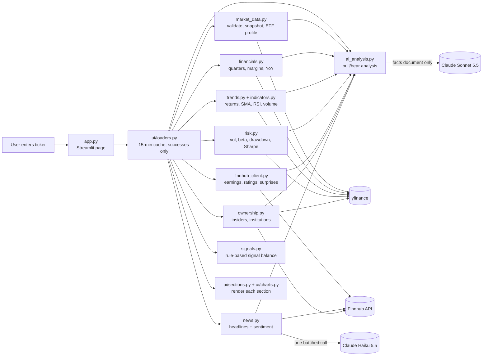

# TickerBrief

[](https://github.com/nathanielmarvyn/stock-research-assistant/actions/workflows/tests.yml)

Search any US stock or ETF by ticker or company name and get a one-page research brief: a snapshot, the last four quarters of financials, price trends against the S&P 500, the Wall Street view, recent news with sentiment, and an AI-written bull/bear analysis that is grounded only in the data on the page.

Built as a portfolio project to show both sides of the work: financial analysis (what to measure, how to read it, where common metrics mislead) and software engineering (modular design, testing, failure handling, cost control).

**Live demo:** [tickerbrief.streamlit.app](https://tickerbrief.streamlit.app/) (try `?ticker=AAPL`, `?ticker=JPM`, or `?ticker=SPY`)


_Snapshot for an ETF (SPY): AUM and expense ratio replace company metrics._

---

## Features

**Search-first homepage.** A centered search box with live suggestions as you type, matching tickers *and* company names across ~11,000 US-listed stocks, ETFs, ADRs, and REITs (typing "apple" offers AAPL · Apple Inc. first). Once a brief opens, search, popular picks, and a home button move into a compact top bar, and the brief fades in. No sidebar.

| Section | What it shows | Source |
|---|---|---|
| **Signal balance** | A rule-based bull/bear reading at the top of the brief: a half-dial gauge whose needle sweeps to the net reading, each factor's −1 to +1 score below it with its rule on hover, and sliders to re-weight factors. Framed as a summary of the evidence, not a recommendation | Computed from the sections below |
| **Snapshot** | Price and day change, market cap, 52-week range (with position bar), next earnings date, dividend yield | Yahoo Finance, Finnhub |
| **Financials** (stocks) | Last 4 quarters: revenue, net income, EPS, free cash flow, gross/operating/net margins, YoY change; trailing and forward P/E; debt-to-equity | Yahoo Finance |
| **Fund profile** (ETFs) | Expense ratio, AUM, category, top 10 holdings | Yahoo Finance |
| **Price trends** | Interactive chart with 50/200-day moving averages and volume; 1M/6M/YTD/1Y total return vs. SPY; RSI(14); volume vs. 30-day average | Yahoo Finance |
| **Risk profile** | 1Y volatility, total return, and Sharpe ratio; 1Y/2Y max drawdown with dates and recovery; 2Y beta and correlation; up/down capture; each beside SPY's value, plus a drawdown chart | Yahoo Finance |
| **Wall Street view** (stocks) | Analyst consensus with month-over-month drift, rating distribution, average price target and implied move | Finnhub, Yahoo Finance |
| **Earnings track record** (stocks) | Last 4 quarters of EPS vs. consensus: beat, miss, or in line (±1%), surprise %, and an estimate-vs-actual chart | Finnhub |
| **Ownership & insider activity** (stocks) | 6 months of open-market insider trades (who, role, shares, value, date, % of holdings), net buying vs. selling, flags for notable activity, % held by insiders and institutions, top 10 institutional holders with quarterly change | Finnhub (SEC Form 4), Yahoo Finance |
| **Recent news** | Up to 10 headlines from the past two weeks with source, date, link, one-line summary, and sentiment, plus an overall score | Finnhub, Claude Haiku 5.5 |
| **AI analysis** | Summary, bull case, bear case, key risks, what to watch, with a grounding check and disclaimer | Claude Sonnet 5.5 |

Every section shows when its data is from ("Data as of Oct 7, 2026, 4:00 PM ET") and where it came from.


_Interactive price chart with 50/200-day moving averages, a separate volume panel, and total returns._


_AI analysis built only from the data on the page, with every figure checked against the source._


_Generating a brief for JPMorgan (JPM) on the live app._

---

## Architecture



### How the pieces fit

- **Each data module follows the same pattern:** a thin `fetch_*` function does the network call, and a pure `parse_*` / `build_*` function turns the response into a typed dataclass. Parsers are tested offline against real responses saved in `tests/fixtures/`.
- **Every section returns a `SectionResult`** (`brief/models.py`): the data, an "as of" timestamp, the source, and an error message if it failed. The `@safe_section` decorator turns any exception into a failed result, so **one broken data source shows a warning card instead of taking down the page.**
- **Expected and unexpected failures are treated differently.** "This ETF has no income statement" or "Finnhub is rate-limiting" raise `DataUnavailableError` and show a clean message. Anything else is logged with a full traceback as a bug.
- **Data modules don't import Streamlit.** Caching and rendering live in `brief/ui/`, so the core logic runs in tests, the terminal preview script, or a future API unchanged.

### Project layout

```
app.py                  Streamlit entry point
brief/
  config.py             Settings and secrets (.env locally, Streamlit secrets when deployed)
  models.py             SectionResult, safe_section, DataUnavailableError
  market_data.py        Ticker validation, snapshot, ETF profile (yfinance)
  financials.py         Quarterly results, margins, YoY, P/E, D/E
  indicators.py         Pure indicator math: returns, SMA, Wilder RSI, relative volume
  trends.py             Price-trends section built from indicators + SPY benchmark
  risk.py               Risk metrics: volatility, beta, correlation, drawdown, Sharpe, capture
  finnhub_client.py     Finnhub HTTP client, earnings date and track record, analyst consensus, price target
  ownership.py          Insider trades (SEC codes + roles), flags, institutional ownership
  news.py               Headline selection and batched sentiment scoring
  ai_analysis.py        Facts document, Claude analysis, grounding check
  signals.py            Signal balance: one pure, tested rule per factor, weighted net score
  symbols.py            Search universe: ~11,000 tickers + cleaned company names, name/ticker resolution
  formatting.py         Number formatting shared by UI and prompts
  ui/
    loaders.py          Cached loaders (Streamlit cache_data)
    sections.py         One render function per section
    charts.py           Plotly figures
scripts/preview.py      Print a brief in the terminal (no UI)
tests/                  Offline unit tests + opt-in live tests (pytest -m live)
```

---

## Design decisions worth calling out

**Financial correctness**
- **Units normalized in one place.** yfinance mixes percent and fraction units (dividend yield `0.32` means 0.32%, while a similar field is already a fraction). Parsers convert everything to fractions, and tests guard it.
- **YoY matched by date, not column position.** Each quarter is compared with the quarter ending about one year earlier. When that quarter isn't available (yfinance often returns only five), the brief shows "—" instead of inventing a comparison.
- **Growth from a negative base** divides by `abs(prior)`, so a loss shrinking from −$10M to −$5M reads as +50%.
- **Debt-to-equity is left blank when equity is negative** (common after heavy buybacks), because the ratio becomes misleading.
- **Free cash flow is hidden for banks and insurers.** Their operating cash flow includes deposit, loan, and premium flows; JPMorgan's swings by hundreds of billions per quarter. Visa and Mastercard (also "Financial Services") keep it.
- **Returns are total returns** (dividend-adjusted prices), and YTD is measured from the prior year's last close.
- **Risk windows are chosen deliberately.** Volatility and Sharpe use 1 year; beta and correlation use 2 years because 1 year proved unstable (AAPL's correlation with SPY was 0.36 over 1 year vs. 0.61 over 2). The 2-year beta (1.07) matches Yahoo's published 1.069.
- **Only real insider trades count.** yfinance's insider summary counts stock grants and option exercises as "purchases" (AAPL showed 12 purchases when insiders made none), so trades are classified by their SEC Form 4 code: only open-market purchases (P) and sales (S) count, and same-day slices are combined per person. Roles come from a second source because Finnhub doesn't provide them.
- **Insider flags are explicit rules,** shown on the page: 3+ insiders buying within 30 days, any open-market buy by a senior executive, and sales of $5M+ in a day or 20%+ of a person's holdings. Sales carry a caveat, since they're often pre-scheduled (10b5-1 plans).
- **EPS surprises are labeled by basis.** Finnhub's "actual" EPS is the adjusted figure analysts forecast and can differ from GAAP diluted EPS (JPM: $6.14 vs. $7.70), so the page says which is which.
- **RSI uses Wilder's smoothing**, unit-tested against a hand-calculated example and cross-checked against an independent implementation.

**A bull/bear scale without a black box**
- **Rules, not a model.** Each factor (trend, relative return, growth, valuation vs. the S&P 500, analyst views, earnings record, insider activity, risk-adjusted return, downside capture, news) maps to −1..+1 by a written rule shown on hover. The same data always gives the same reading.
- **Weights belong to the viewer.** Sliders change how much each factor counts, which makes the point an advisor would make to a client: the conclusion depends on what you prioritize.
- **Labeled as evidence, not advice.** Zones read "mostly bullish / mixed / mostly bearish signals," and colors are navy vs. burgundy (not green vs. red) with labels, so they work for colorblind readers.

**Design**
- **"Classic research" theme** (cream, charcoal, burgundy; Lora headings over Inter) defined entirely in `.streamlit/config.toml`, with light and dark variants that follow the viewer's system setting.
- **Chart colors were validated, not eyeballed:** the three line colors passed a palette checker for colorblind separation, normal-vision distinctness, and 3:1 contrast against each mode's background, and charts switch palettes with the theme.

**AI that stays grounded**
- **The model only sees a "facts" document** built from the fetched sections, with numbers pre-formatted (`$109.42B`, `+16.4%`) so it can't confuse units. Missing sections are listed explicitly so it says "unavailable" instead of guessing.
- **Every figure the model writes is checked against the facts.** Anything not found verbatim is shown to the reader as unverified.
- **Structured output** (Pydantic schema) means the app never parses free text, and a malformed reply can't break the page.
- **No recommendations.** The prompt forbids buy/sell/hold language and price predictions, and every analysis carries a disclaimer.
- **Headlines are treated as untrusted input.** They're wrapped in tags, and the model is told to ignore instructions inside them (prompt-injection defense).
- **The overall news score is computed in code** (the average of +1/0/−1 labels), not asked of the model.

**Reliability and cost**
- **Caching:** 15-minute cache per section, and failures are never cached, so a rate limit retries on the next lookup.
- **Finnhub client:** retries with backoff on HTTP 429, and gives clear messages for bad keys, paid-only endpoints, and timeouts.
- **Graceful degradation:** if Claude is down, the news section still shows headlines with source summaries. If Finnhub is down, the price target still shows.
- **Search that ranks sensibly without a search engine:** Finnhub's free symbol list is filtered to major exchanges and cleaned ("BERKSHIRE HATHAWAY INC-CL B" becomes "Berkshire Hathaway Inc Class B"), well-known companies are listed first, and the search box filters by substring while keeping that order. Free text still works: "jp morgan" + Enter resolves to JPM, and unknown input is tried as a ticker.
- **Custom graphics survive Streamlit's sanitizer:** the logo and gauge are SVGs delivered as data-URI images (inline SVG is stripped), with the needle's sweep animation defined inside the SVG and disabled for viewers who prefer reduced motion.
- **Interactive without waste:** the signal-balance sliders run inside a Streamlit fragment, so moving one re-weights cached data instantly instead of rerunning the page or calling any API.
- **Cost controls:** one batched Haiku call for all headlines at `low` effort; Sonnet at `medium` effort with a token cap; at most 10 AI analyses per browser session on the public demo. Measured usage per new brief: Haiku sentiment ≈ 2K input / 0.7K output tokens, Sonnet analysis ≈ 2–3K input / ~1K output tokens (about 1.3–1.7 cents); cached repeats are free.

---

## Setup

Requires **Python 3.11+**, plus free API keys from [Finnhub](https://finnhub.io/) and [Anthropic](https://console.anthropic.com/).

```bash
git clone https://github.com/nathanielmarvyn/stock-research-assistant.git
cd stock-research-assistant

python -m venv .venv
# Windows:
.venv\Scripts\activate
# macOS/Linux:
source .venv/bin/activate

pip install -r requirements.txt
```

Copy the environment template and add your keys:

```bash
cp .env.example .env      # Windows: copy .env.example .env
```

```
FINNHUB_API_KEY=your_finnhub_key
ANTHROPIC_API_KEY=your_anthropic_key   # starts with sk-ant-api03-
```

`.env` is in `.gitignore` and never committed. Keep the placeholders in `.env.example`.

### Run

```bash
streamlit run app.py
```

Open http://localhost:8501 and search by ticker or company name, or go straight to a brief with http://localhost:8501/?ticker=AAPL.

To print a brief in the terminal without the UI:

```bash
python scripts/preview.py AAPL
```

### Tests

```bash
pytest            # offline unit tests (fast, no network, no API keys)
pytest -m live    # live smoke tests against Yahoo Finance and Finnhub with AAPL and SPY
```

GitHub Actions runs the offline suite on Python 3.11, 3.12, and 3.13 for every push and pull request (no API keys needed).

### Configuration

Non-secret settings live in `brief/config.py`: Claude models, token limits and effort, cache TTL, news window, benchmark ticker, and the per-session AI cap.

---

## Deploy to Streamlit Community Cloud

1. Push this repository to GitHub.
2. At [share.streamlit.io](https://share.streamlit.io), click **Create app** and choose the repo, branch `main`, and main file `app.py`.
3. Under **Advanced settings**, choose **Python 3.12** or newer, and paste your keys into **Secrets** (TOML format, see `.streamlit/secrets.toml.example`):
   ```toml
   FINNHUB_API_KEY = "your_finnhub_key"
   ANTHROPIC_API_KEY = "your_anthropic_key"
   ```
4. Deploy. `brief/config.py` reads environment variables first, then Streamlit secrets, so the code is the same locally and in the cloud.

---

## Known limitations

- **Data freshness:** Yahoo Finance quotes may be delayed, and data is cached for 15 minutes.
- **Short quarterly history:** yfinance usually returns about five quarters, so YoY is often available for the latest quarter only.
- **Yahoo rate limits:** Yahoo can throttle shared cloud IP addresses, so a hosted demo may occasionally show "rate-limiting" warnings. Retrying usually works.
- **Free-tier APIs:** Finnhub's free plan excludes price targets (taken from Yahoo instead) and allows 60 calls per minute.
- **News relevance:** headlines are filtered by company name or ticker. Some will mention the company without being mainly about it, and ETFs often have little ticker-specific news.
- **Sentiment is approximate:** it's a model's reading of a headline and short snippet, not of the full article.
- **The AI analysis can still be wrong.** The grounding check catches invented numbers, not flawed reasoning.
- **Scope:** US-listed stocks and ETFs only. No mutual funds, crypto, options, or non-US listings.

---

## Roadmap

**v2 (complete)**
- ✅ GitHub Actions CI on every push
- ✅ Risk profile (volatility, beta, drawdown, Sharpe, capture ratios)
- ✅ Earnings track record
- ✅ Ownership and insider activity with rule-based flags
- ✅ "Classic research" theme with light and dark modes
- ✅ Interactive, rule-based signal-balance gauge
- ✅ TickerBrief branding, search-first homepage, company-name search with live suggestions

**Later**
- Client-ready PDF export of the brief
- Portfolio analyzer: sector exposure, blended risk, ETF overlap
- Peer valuation table and side-by-side comparison
- Simple reverse-DCF view

---

## Disclaimer

This project is for informational and educational purposes only. Nothing it produces is investment, financial, legal, or tax advice, or a recommendation to buy, sell, or hold any security. Market data may be delayed, incomplete, or inaccurate, and AI-generated analysis may contain errors. Verify all information independently and consult a licensed financial professional before making investment decisions. The author is not a licensed financial advisor.
